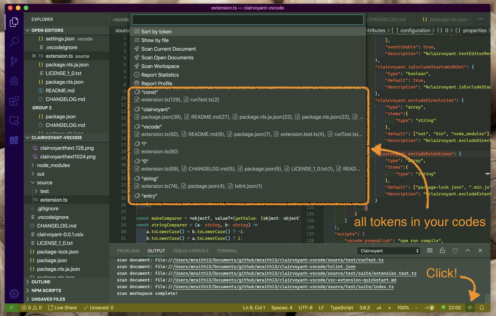
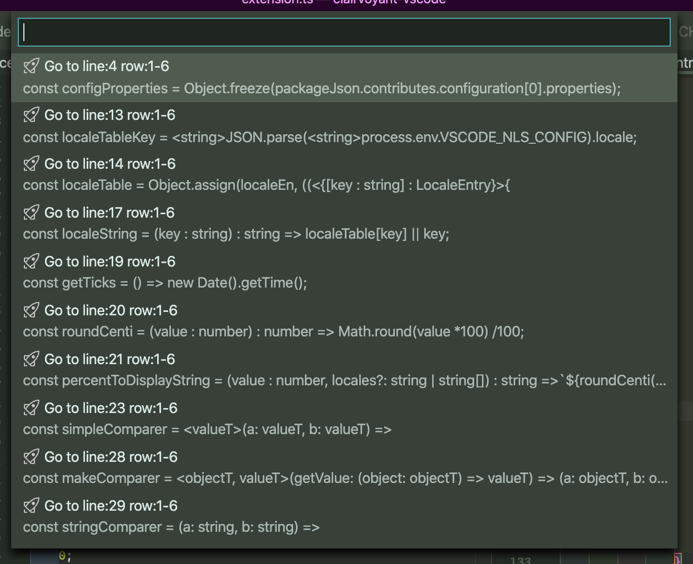

# Clairvoyant

Smart search your codes.

## Features

Clairvoyant scans your code and enumerates all tokens and provides access to them.

## Tutorial

### 0. ⬇️ Install Clairvoyant

Show extension side bar within VS Code(Mac:<kbd>Command</kbd>+<kbd>Shift</kbd>+<kbd>X</kbd>, Windows and Linux: <kbd>Ctrl</kbd>+<kbd>Shift</kbd>+<kbd>X</kbd>), type `clairvoyant` and press <kbd>Enter</kbd> and click <kbd>Install</kbd>. Restart VS Code when installation is completed.

### 1. 🔍 Scan your codes

Launch Command Palette(Mac:<kbd>F1</kbd> or <kbd>Shift</kbd>+<kbd>Command</kbd>+<kbd>P</kbd>, Windows and Linux: <kbd>F1</kbd> or <kbd>Shift</kbd>+<kbd>Ctrl</kbd>+<kbd>P</kbd>), Execute `Clairvoyant: Scan Current Document` or `Clairvoyant: Scan Open Documents` or `Clairvoyant: Scan Workspace` command. You can also scan automatically. Specify settings for `clairvoyant.autoScanMode` ( default: "open documents" ).

### 2. 🚀 Sight your codes

Launch Command Palette, Execute `Clairvoyant: Sight` command or click eys icon on status bar. You can access to all tokens.

### 3. 🔧 Next step

You can change [settings](#extension-settings) by `settings.json`. And you can apply [keyboard shortcuts](#keyboard-shortcut-settings) by `keybindings.json`.

Enjoy!

## Commands

* `Clairvoyant: Sight` : Access to tokens in your codes with menu.
* `Clairvoyant: Scan Current Document` : Scan current document
* `Clairvoyant: Scan Open Documents` : Scan open documents
* `Clairvoyant: Scan Workspace` : Scan workspace
* `Clairvoyant: Go Back` : Go cursor postion back
* `Clairvoyant: Go Forward` : Go cursor postion forward
* `Clairvoyant: Report Statistics` : Show statistics data
* `Clairvoyant: Report Profile` : Show profile data
* `Clairvoyant: Reload` : Reload this extention

## Extension Settings

This extension contributes the following settings by [`settings.json`](https://code.visualstudio.com/docs/customization/userandworkspace#_creating-user-and-workspace-settings)( Mac: <kbd>Command</kbd>+<kbd>,</kbd>, Windows / Linux: <kbd>File</kbd> -> <kbd>Preferences</kbd> -> <kbd>User Settings</kbd> ):

* `clairvoyant.autoScanMode`: auto scan mode
* `clairvoyant.maxFiles`: max files
* `clairvoyant.showStatusBarItems`: show status bar items
* `clairvoyant.textEditorRevealType`: display options when moving the cursor
* `clairvoyant.isExcludeStartsWidhDot`: exclude path starts widh `.`
* `clairvoyant.excludeDirectories`: exclude directories
* `clairvoyant.excludeExtentions`: exculde file extentions
* `clairvoyant.targetProtocols`: target dcoument protocols ( You can exclude `untitled:` or add `output:` or others. )

## Keyboard shortcut Settings

In default, clairvoyant's commands doesn't apply keyboard shortcuts. Althogh,
you can apply keyboard shortcuts by [`keybindings.json`](https://code.visualstudio.com/docs/customization/keybindings#_customizing-shortcuts)
( Mac: <kbd>Code</kbd> -> <kbd>Preferences</kbd> -> <kbd>Keyboard Shortcuts</kbd>, Windows / Linux: <kbd>File</kbd> -> <kbd>Preferences</kbd> -> <kbd>Keyboard Shortcuts</kbd>).

Command name on `keybindings.json` is diffarent from on Command Pallete. See below table.

|on Command Pallete|on keybindings.json|
|-|-|
|`Clairvoyant: Sight`|`clairvoyant.sight`|
|`Clairvoyant: Scan Current Document`|`clairvoyant.scanDocument`|
|`Clairvoyant: Scan Open Documents`|`clairvoyant.scanOpenDocuments`|
|`Clairvoyant: Scan Workspace`|`clairvoyant.scanWorkspace`|
|`Clairvoyant: Go Back`|`clairvoyant.back`|
|`Clairvoyant: Go Forward`|`clairvoyant.forward`|
|`Clairvoyant: Report Statistics`|`clairvoyant.reportStatistics`|
|`Clairvoyant: Report Profile`|`clairvoyant.reportProfile`|
|`Clairvoyant: Reload`|`clairvoyant.reload`|

## Release Notes

see ChangLog on [marketplace](https://marketplace.visualstudio.com/items/wraith13.clairvoyant-vscode/changelog) or [github](https://github.com/wraith13/clairvoyant-vscode/blob/master/CHANGELOG.md)

## Support

[GitHub Issues](https://github.com/wraith13/clairvoyant-vscode/issues)

## License

[Boost Software License](https://github.com/wraith13/clairvoyant-vscode/blob/master/LICENSE_1_0.txt)
